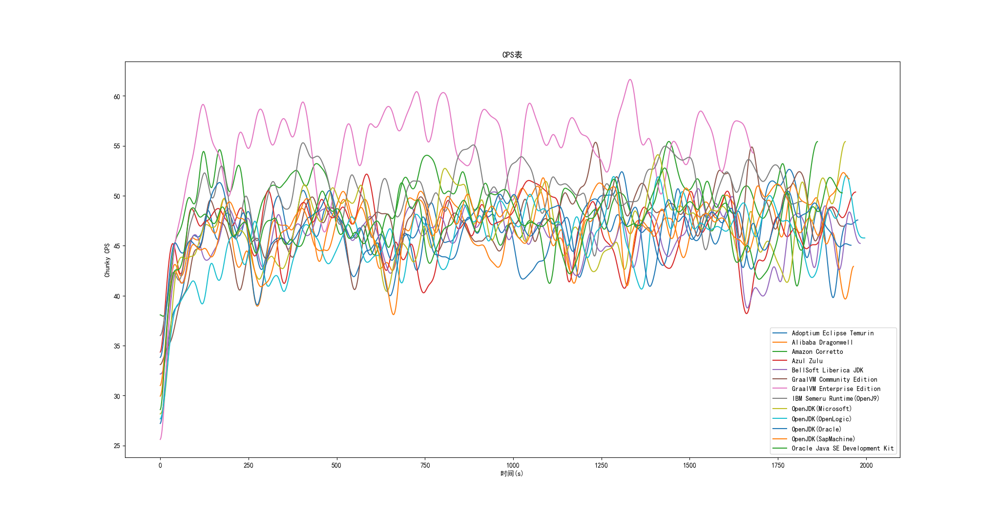
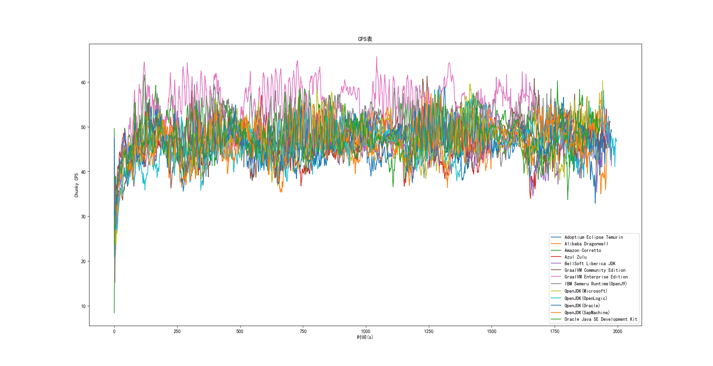

# Windows 结果

测试环境：

Intel Core i7-10700k(分配8核)

8GB 内存
 
Purpur 1.21 Build 2273

## MVP

综合最强: GraalVM Enterprise Edition

性能最好: GraalVM Enterprise Edition(0:29:53)

性能最差: OpenLogic OpenJDK(0:36:02)

内存占用最低: OpenJ9

## 图表

CPS 变动(高斯平滑,sigma=10):

(GraalVM EE 遥遥领先)

CPS 变动(别看了):

## 性能

嘻嘻，Zulu都不配上榜(一开始我也很震惊,于是Zulu测了两遍),让我们把 Azul 的未来交给 Zing()

### GraalVM Enterprise Edition

生成用时:0:29:53

平均CPS:55.0325996430696

(其实除了战神 GraalVM EE,后面的JDK差距并不大)

### IBM Semeru Runtime(OpenJ9)

生成用时:0:32:47

平均CPS:50.305063291139234

### Amazon Corretto

生成用时:0:33:32

平均CPS:49.16140633387011

### GraalVM Community Edition

生成用时:0:34:47

平均CPS:47.35085183273103

### Oracle Java SE Development Kit

(4 秒，就四秒)

生成用时:0:34:51

平均CPS:47.23290222452147

各个JDK详细指标和完整日志在本目录
