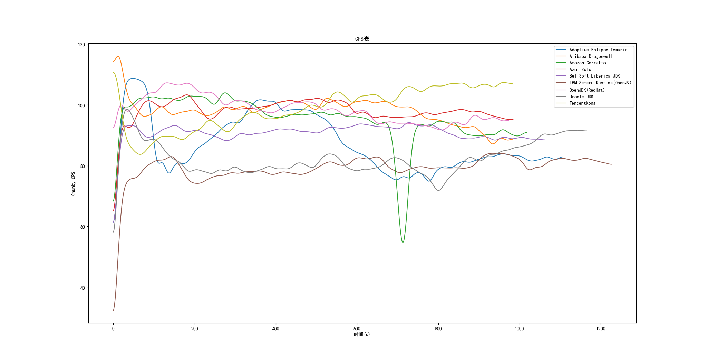
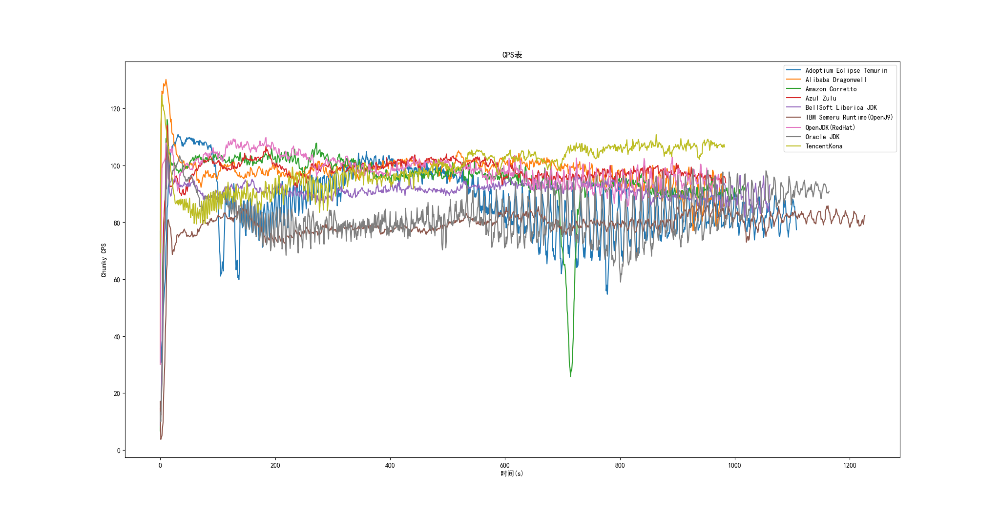
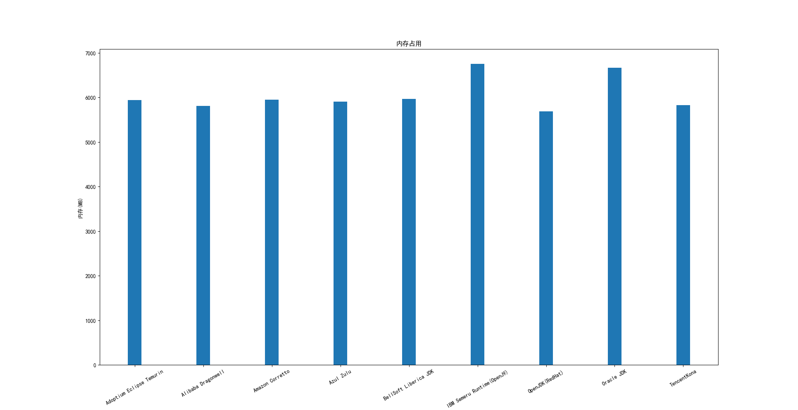

# Windows 结果

测试环境：

Intel Core i7-10700k(分配8核)

8GB 内存

Paper 1.13.2

## MVP

综合最强: OpenJDK(RedHat)

性能最好: Azul Zulu/TencentKona

性能最差: IBM OpenJ9

内存占用最高: IBM OpenJ9

内存占用最低: OpenJDK(RedHat)

## 图表

CPS 变动(高斯平滑,sigma=10):

CPS 变动(别看了):

内存使用:

## 性能

### Azul Zulu/TencentKona

生成用时:0:16:50

Zulu 平均CPS:98.08345177664972

TencentKona 平均CPS:98.80091556459816

### OpenJDK(RedHat)

生成用时:0:16:53

平均CPS:98.54394250513346

### Alibaba Dragonwell

生成用时:0:16:56

平均CPS:98.10040691759919

## 内存

### OpenJDK(RedHat)

内存占用:5690MB

### Alibaba Dragonwell 

内存占用:5808MB

### TencentKona

内存占用:5831MB
